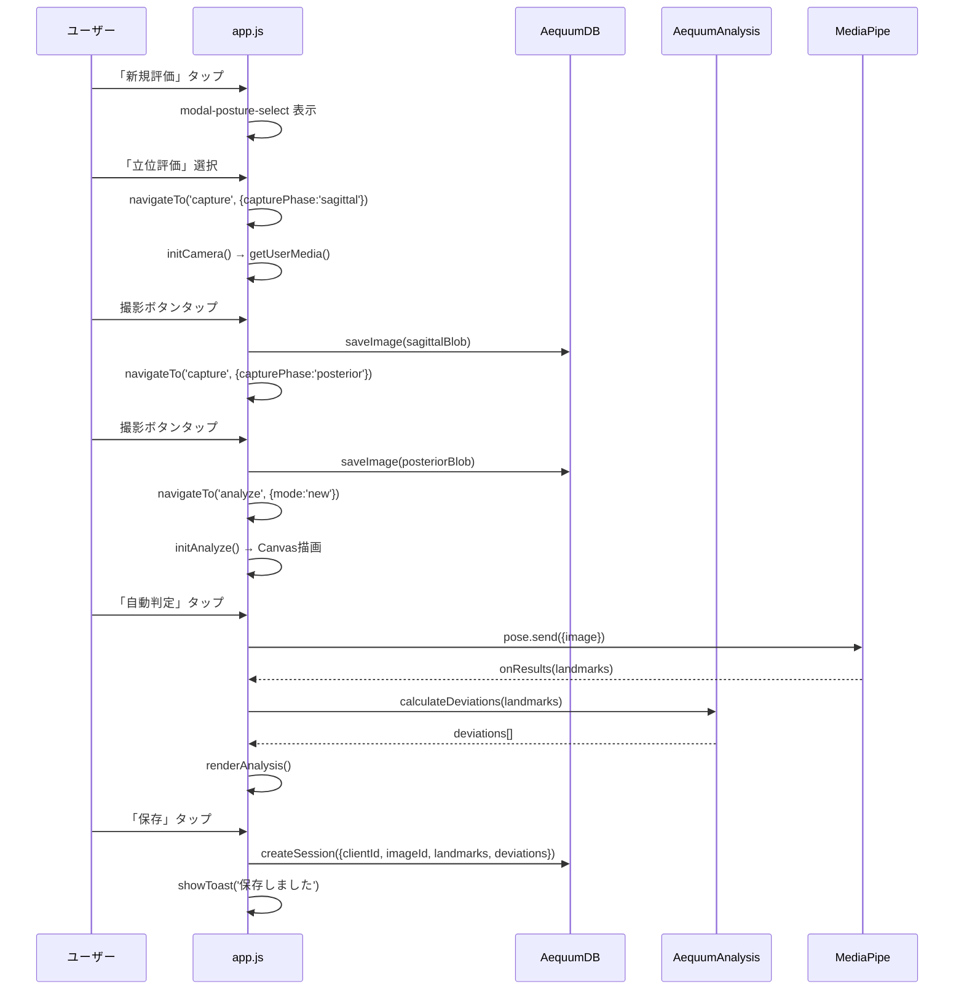

# 02: App Controller Agent 仕様書

## 担当ファイル
- [app.js](file:///c:/Users/n0k7i/OneDrive/デスクトップ/Axis/app.js) — 2747行 ★最大ファイル

## 責務範囲

### ファイル概要
app.js は即時実行関数（IIFE）内に全コントローラロジックを格納。巨大な単一ファイルのため、論理的なセクションを把握することが重要。

### コードセクションマップ

| 行範囲(概算) | セクション | 主な関数 |
|-------------|-----------|---------|
| L1-55 | 定数・State定義・初期化 | `state`, `init()` |
| L56-196 | SPA ナビゲーション | `navigateTo()`, `goBack()`, `updateHeader()` |
| L198-213 | リソースクリーンアップ | `cleanupResources()` |
| L215-359 | グローバルイベントバインド | `bindGlobalEvents()` |
| L361-376 | トースト通知 | `showToast()` |
| L378-444 | 患者一覧ページ | `loadClients()`, `renderClientList()`, `handleSearch()` |
| L446-515 | 新規患者登録 | `resetClientForm()`, `handleSaveClient()` |
| L517-624 | 患者詳細 | `loadClientDetail()`, `renderClientProfile()`, `renderSessionTimeline()` |
| L626-850+ | カメラ / 撮影 | `initCamera()`, グリッド描画, 水平器, キャプチャ処理 |
| L850-1400+ | 解析画面 | `initAnalyze()`, `renderAnalysis()`, ランドマーク配置/移動, Canvas操作, ズーム/パン |
| L1400-1700+ | 自動検出（MediaPipe） | `runAutoDetection()`, MediaPipe Pose連携 |
| L1700-2100+ | 比較画面 | `initCompare()`, 並列比較, オニオンスキン, トレンドグラフ |
| L2100-2500+ | レポート画面 | `initReport()`, `handleExportPDF()`, `handleShareReport()` |
| L2500-2747 | ユーティリティ | `escapeHtml()`, `formatDate()`, `calculateAge()`, DOMContentLoaded |

### State オブジェクト構造

```javascript
const state = {
  // ── ナビゲーション ──
  currentPage: 'clients',       // 現在表示中のページID
  navigationStack: [],          // 戻るボタン用のスタック

  // ── 患者 ──
  currentClient: null,          // 現在選択中の患者オブジェクト

  // ── セッション ──
  currentSession: null,         // 現在表示/編集中のセッション

  // ── カメラ ──
  cameraStream: null,           // MediaStream
  gyroWatcher: null,            // DeviceOrientation リスナー

  // ── 解析 ──
  analyzeImage: null,           // 解析対象のImage要素
  placedLandmarks: [],          // 配置済みランドマーク [{id, x, y}]
  selectedLandmark: null,       // 選択中のランドマーク
  isDragging: false,            // ドラッグ中フラグ
  showPlumbLine: true,          // 基準線表示
  showInfoPanel: true,          // 詳細パネル表示
  moveMode: false,              // ランドマーク移動モード
  scaleFactor: null,            // px → cm 変換係数
  drawState: null,              // Canvas描画状態

  // ── ズーム & パン ──
  viewZoom: 1,                  // 拡大率
  viewPanX: 0,                  // パンX
  viewPanY: 0,                  // パンY

  // ── 比較 ──
  compareBeforeSession: null,   // 比較前セッション
  compareAfterSession: null,    // 比較後セッション

  // ── 向き ──
  facingDirection: 1,           // 1=右向き, -1=左向き

  // ── UIフィルタ ──
  timelineFilter: 'all',        // タイムラインフィルタ

  // ── 姿勢タイプ ──
  posture: 'standing',          // 'standing' or 'seated'
};
```

### 主要関数のインターフェース

#### ナビゲーション
```javascript
navigateTo(page: string, data?: object): void
// page: 'clients' | 'new-client' | 'client-detail' | 'capture' | 'analyze' | 'compare' | 'report'
// data: { clientId?, sessionId?, capturePhase?, mode?, posture? }

goBack(): void
// navigationStack からポップして前のページへ
```

#### カメラ
```javascript
initCamera(data: { clientId, capturePhase, posture?, sagittalImageId?, sagittalImageBlob? }): void
// capturePhase: 'sagittal' | 'posterior' | 'seated_sagittal'
// 撮影フロー:
//   standing: sagittal撮影 → posterior撮影 → analyze
//   seated:   seated_sagittal撮影 → analyze
```

#### 解析
```javascript
initAnalyze(data: { sessionId?, mode, clientId?, imageBlob?, imageId?, posture? }): void
// mode: 'new' (新規撮影から) | 'view' (既存セッション閲覧)
// 新規: imageBlob + imageId を受け取ってCanvas描画
// 既存: sessionId からDB読み込み

renderAnalysis(): void
// state.placedLandmarks + state.analyzeImage からCanvas再描画
// AequumAnalysis の描画ユーティリティを使用
```

#### 比較
```javascript
initCompare(clientId: string): void
// 3つの比較モード: side-by-side, onion-skin, trend
```

#### レポート
```javascript
initReport(data: { mode, clientId?, sessionId? }): void
// mode: 'patient' (全セッション横断) | 'session' (単一セッション)
// AequumAnalysis.generateReportHTML() を呼び出し

handleExportPDF(): void
// window.print() ベースのPDF出力

handleShareReport(): void
// Web Share API (navigator.share) を使用
```

### 外部依存

| 依存先 | 使用箇所 | API |
|--------|---------|-----|
| `AequumDB` | 全ページ | `createClient`, `getClient`, `getAllClients`, `getSessionsByClient`, `saveImage`, `getImage`, `createSession`, `updateSession` 等 |
| `AequumAnalysis` | 解析/比較/レポート | `getLandmarks`, `calculateDeviations`, `calculateScaleFactor`, `drawPlumbLine`, `drawLandmark`, `drawDeviationLine`, `generateReportHTML`, `generateTrendData` 等 |
| MediaPipe `Pose` | 自動検出 | `new Pose({...})`, `pose.send({image})` |
| `navigator.mediaDevices` | カメラ | `getUserMedia({video: {facingMode: 'environment'}})` |
| `DeviceOrientationEvent` | 水平器 | `deviceorientation` イベント |

### イベントフロー（撮影→保存の完全フロー）



### 既知の問題

> [!CAUTION]
> - L22-27: `window.onerror` で `alert()` を使用 → プロダクションでは除去必要
> - 巨大なIIFE内に全ロジックが混在 → 分割リファクタリングが必要
> - Canvas操作のメモリリーク可能性（Image参照の未解放）
> - 全角→半角変換が `input-patient-no` にのみ適用（`client-search` にも適用済みだが別実装）

## タスクリスト

- [ ] app.js 全体の関数マップ・依存グラフの完成
- [ ] ナビゲーションロジックの検証（スタック整合性）
- [ ] カメラ初期化フロー（getUserMedia, エラーハンドリング）の確認
- [ ] ランドマーク配置/移動のタッチ・マウスイベント処理の把握
- [ ] ズーム/パン操作（ピンチズーム、ホイール）の実装確認
- [ ] 自動検出（MediaPipe連携）のフローとフォールバック確認
- [ ] 比較画面の3モード（並列・オニオン・トレンド）のレンダリング検証
- [ ] レポート生成とPDF出力の動作確認
- [ ] `alert()` ベースのエラーハンドラ除去
- [ ] app.js 分割計画（ページコントローラごとのモジュール化）の策定
- [ ] メモリリーク対策（Canvas, Image, MediaStream の適切な解放）
