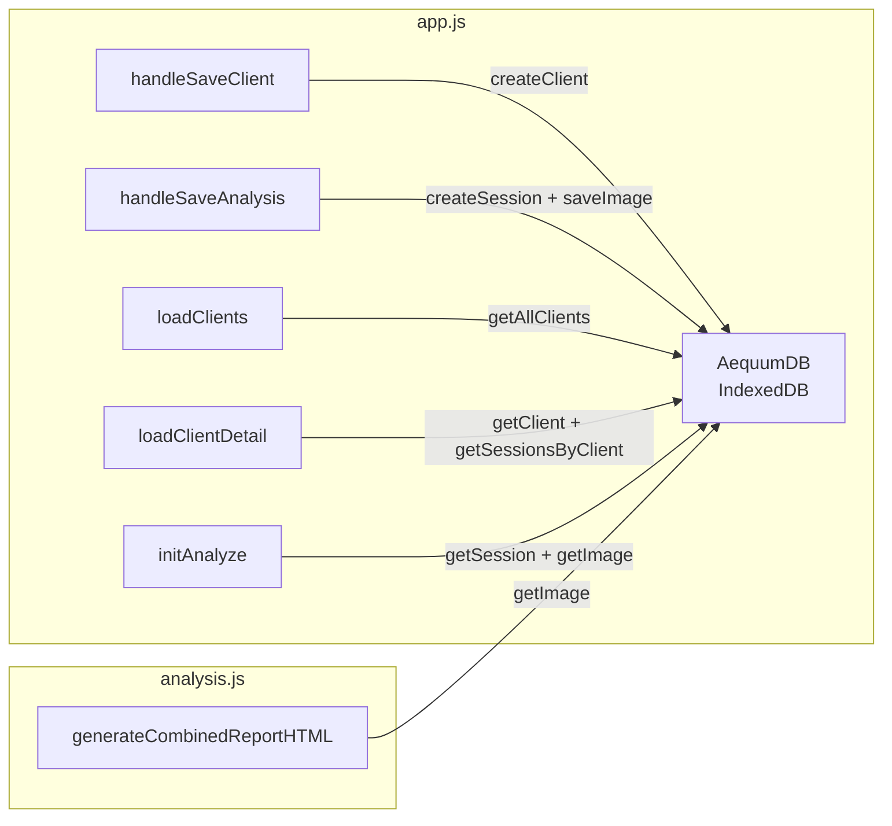

# 04: Data Layer Agent 仕様書

## 担当ファイル
- [db.js](file:///c:/Users/n0k7i/OneDrive/デスクトップ/Axis/db.js) — 278行

## 責務範囲

### ファイル概要
`AequumDB` は IIFE モジュールとして、IndexedDBへの全データ操作を提供する。クライアント（患者）、セッション（評価）、画像（バイナリBlob）の3つのオブジェクトストアを管理。

---

## データベーススキーマ

### DB情報
```javascript
DB_NAME = 'aequum_db'
DB_VERSION = 1
```

### オブジェクトストア

#### `clients` — 患者データ

| フィールド | 型 | 説明 | インデックス |
|-----------|-----|------|------------|
| `id` | string | keyPath。`Date.now().toString(36) + random` | — |
| `patientNo` | string | 患者番号（数字文字列） | — |
| `name` | string | 氏名 | ✅ `name` (non-unique) |
| `dateOfBirth` | string | 生年月日 (YYYY-MM-DD) | — |
| `gender` | string | `'male'` / `'female'` / `'other'` / `''` | — |
| `heightCm` | number\|null | 身長(cm) | — |
| `medicalHistory` | string | 既往歴 | — |
| `chiefComplaint` | string | 主訴 | — |
| `createdAt` | string | ISO 8601 | ✅ `createdAt` |
| `updatedAt` | string | ISO 8601 | — |

#### `sessions` — 評価セッション

| フィールド | 型 | 説明 | インデックス |
|-----------|-----|------|------------|
| `id` | string | keyPath | — |
| `clientId` | string | 患者ID（FK） | ✅ `clientId` |
| `capturedAt` | string | 撮影日時 ISO 8601 | ✅ `capturedAt` |
| `imageId` | string\|null | 画像ID（`images` ストア参照） | — |
| `landmarks` | Array | `[{id, x, y}, ...]` ランドマーク座標 | — |
| `deviations` | Array | `[{landmarkId, landmarkName, deviationPx, deviationCm, status}, ...]` | — |
| `notes` | string | メモ | — |
| `scaleFactor` | number\|null | px → cm 変換係数 | — |
| `viewType` | string | `'sagittal'` / `'posterior'` / `'seated_sagittal'` | — |

#### `images` — 画像バイナリ

| フィールド | 型 | 説明 |
|-----------|-----|------|
| `id` | string | keyPath |
| `blob` | Blob | 画像バイナリ |
| `createdAt` | string | ISO 8601 |

---

## Public API

### 初期化

```javascript
init(): Promise<IDBDatabase>
// DB接続を開き、onupgradeneeded でストア作成
```

### Client CRUD

```javascript
createClient(data: {
  patientNo: string,
  name: string,
  dateOfBirth?: string,
  gender?: string,
  heightCm?: string|number,
  medicalHistory?: string,
  chiefComplaint?: string
}): Promise<Client>
// ID自動生成、createdAt/updatedAt 自動設定
// heightCm は parseFloat() で数値変換

updateClient(id: string, data: Partial<Client>): Promise<Client>
// 既存レコードを取得 → マージ → updatedAt 更新

getClient(id: string): Promise<Client|undefined>

getAllClients(): Promise<Client[]>
// updatedAt の降順でソート

deleteClient(id: string): Promise<void>
// ★カスケード削除: 紐づく全sessions → 各sessionのimage も削除

searchClients(query: string): Promise<Client[]>
// name, patientNo, chiefComplaint を toLowerCase() で部分一致検索

findClientByPatientNo(patientNo: string): Promise<Client|null>
// 患者番号の完全一致検索（重複チェック用）
```

### Session CRUD

```javascript
createSession(data: {
  clientId: string,
  imageId?: string,
  landmarks?: Array,
  deviations?: Array,
  notes?: string,
  scaleFactor?: number,
  viewType?: string
}): Promise<Session>
// ID自動生成、capturedAt 自動設定
// ★副作用: 対応する client の updatedAt を更新

updateSession(id: string, data: Partial<Session>): Promise<Session>

getSession(id: string): Promise<Session|undefined>

getSessionsByClient(clientId: string): Promise<Session[]>
// clientId インデックスで取得、capturedAt 降順ソート

deleteSession(id: string): Promise<void>
// ★カスケード: 紐づく image も削除
```

### Image CRUD

```javascript
saveImage(blob: Blob): Promise<string>
// ID自動生成、createdAt 自動設定、IDを返す

getImage(id: string): Promise<Blob|null>

deleteImage(id: string): Promise<void>
```

### ユーティリティ

```javascript
generateId(): string
// Date.now().toString(36) + Math.random().toString(36).substr(2, 9)

clearAllData(): Promise<void>
// ⚠ 全ストアをクリア
```

---

## 内部ヘルパー

```javascript
_tx(storeName, mode?): IDBObjectStore
// トランザクション取得ショートカット

_put(storeName, data): Promise
_get(storeName, id): Promise
_getAll(storeName): Promise<Array>
_delete(storeName, id): Promise
_getAllByIndex(storeName, indexName, value): Promise<Array>
_clear(storeName): Promise   // ⚠ バグあり
```

---

## 既知のバグ

> [!CAUTION]
> ### `_clear` 関数のバグ (L225-233)
> ```javascript
> function _clear(storeName) {
>   return new Promise((resolve, reject) => {
>     const transaction = _db.transaction([storeName], 'readwrite');
>     //                  ^^^ ここ: _db は存在しない。正しくは db
>   });
> }
> ```
> `_db` は定義されていない変数。`clearAllData()` を呼ぶと `ReferenceError` が発生する。
> **修正**: `_db` → `db` に変更するか、`_tx()` ヘルパーを利用する設計に統一。

## データフロー図



## タスクリスト

- [ ] `_clear` のバグ修正（`_db` → `db`）
- [ ] スキーマバージョニング戦略の策定（DB_VERSION 2以降の計画）
- [ ] データエクスポート機能の実装（JSON形式）
- [ ] データインポート機能の実装（バリデーション付き）
- [ ] セッション検索機能の追加（日付範囲、viewType フィルタ）
- [ ] 画像圧縮の検討（saveImage 時にリサイズ）
- [ ] ストレージ使用量の監視機能
- [ ] バックアップ/リストア機能
- [ ] データ整合性チェック（孤立image, 孤立sessionの検出と削除）
- [ ] TypeScript型定義の生成（Client, Session, Image の型）
