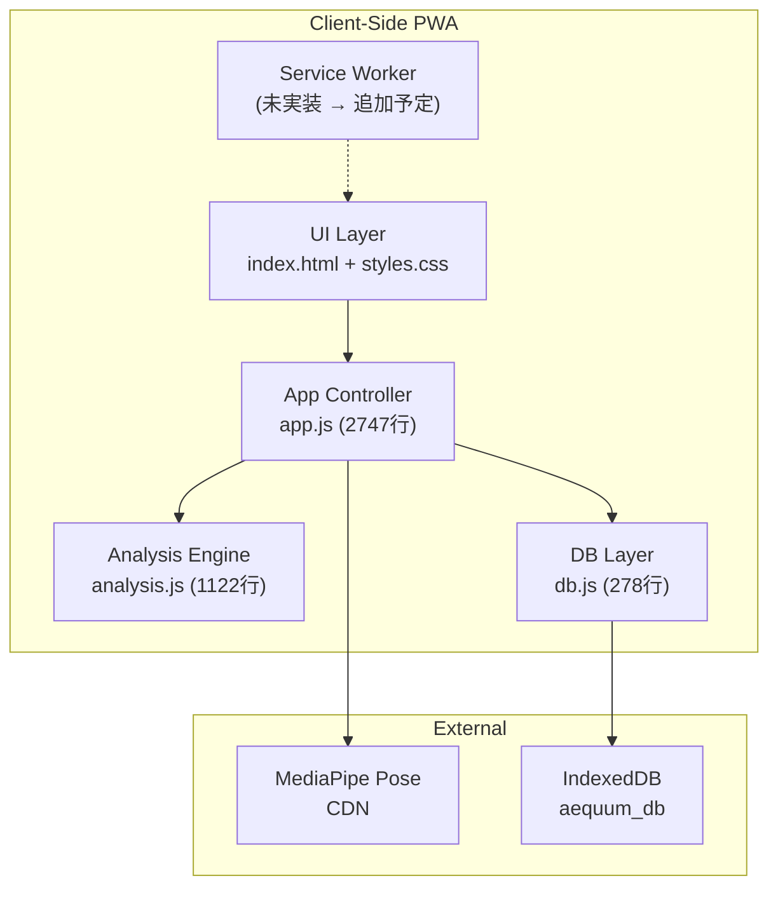

# Aequum — Master Plan (親エージェント用)

> **アプリ名**: Aequum（ver 0.69 → 1.0 計画）
> **目的**: プロフェッショナル向け姿勢評価PWA
> **ターゲット**: 理学療法士・柔道整復師・整体師・トレーナー等
> **技術スタック**: Vanilla HTML/CSS/JS (SPA), IndexedDB, MediaPipe Pose, PWA (Service Worker)
> **テーマ**: ライトモード基調 / プレミアム医療UI

---

## 1. アーキテクチャ全体像



## 2. 現行ファイルツリー

```
Axis/
├── index.html          # SPA シェル (465行) — 全ページ定義
├── styles.css          # デザインシステム (1589行)
├── app.js              # メインコントローラ (2747行) ★巨大
├── analysis.js         # 解析エンジン (1122行)
├── db.js               # IndexedDB CRUD (278行)
├── manifest.json       # PWA マニフェスト
├── assets/             # アイコン等
├── test_posture.png    # テスト画像
└── specs/              # ← 本仕様書群
    ├── master_plan.md
    └── agent_specs/
        ├── 01_ui_design.md
        ├── 02_app_controller.md
        ├── 03_analysis_engine.md
        ├── 04_data_layer.md
        └── 05_pwa_infra.md
```

## 3. ページ構成（SPA ルーティング）

| Page ID | 画面名 | 概要 |
|---------|--------|------|
| `page-clients` | 患者一覧 | 患者カード一覧、検索、FAB追加 |
| `page-new-client` | 新規患者登録 | フォーム（患者番号/氏名/生年月日/性別/身長/既往歴/主訴） |
| `page-client-detail` | 患者詳細 | プロフィール、セッションタイムライン、フィルタタブ |
| `page-capture` | 撮影画面 | カメラプレビュー + 水平器 + グリッド + アップロード |
| `page-analyze` | 解析画面 | Canvas描画、ランドマーク配置/移動、偏差計算、自動検出 |
| `page-compare` | 比較画面 | 並列比較 / オニオンスキン / トレンドグラフ |
| `page-report` | レポート | 分析レポート生成 + PDF出力 + 共有 |

## 4. 子エージェント定義とルーティング

### エージェントマッピング

| # | エージェント名 | 仕様書ファイル | 担当ファイル | 主な責務 |
|---|--------------|-------------|-------------|---------|
| 01 | UI/Design Agent | `01_ui_design.md` | `index.html`, `styles.css` | HTML構造、CSSデザインシステム、レスポンシブ、モーダル |
| 02 | App Controller Agent | `02_app_controller.md` | `app.js` | SPA ルーティング、カメラ、ランドマークエディタ、比較、レポート |
| 03 | Analysis Engine Agent | `03_analysis_engine.md` | `analysis.js` | 偏差計算、角度計算、プラムライン、MediaPipe連携、描画 |
| 04 | Data Layer Agent | `04_data_layer.md` | `db.js` | IndexedDB CRUD、スキーマ、データマイグレーション |
| 05 | PWA/Infra Agent | `05_pwa_infra.md` | `manifest.json`, Service Worker | オフライン対応、キャッシュ戦略、インストール |

### ルーティングルール（タスク振り分け）

```
IF タスクが「CSSの色変更」「レイアウト調整」「新しいモーダルの追加」
  → 01_ui_design.md を参照

IF タスクが「新しいページの追加」「ナビゲーション修正」「カメラ制御」「撮影フロー」
  → 02_app_controller.md を参照

IF タスクが「計測ロジック変更」「新しいランドマーク追加」「MediaPipe精度改善」
  → 03_analysis_engine.md を参照

IF タスクが「データスキーマ変更」「検索機能改善」「エクスポート/インポート」
  → 04_data_layer.md を参照

IF タスクが「オフライン対応」「PWA改善」「パフォーマンス最適化」
  → 05_pwa_infra.md を参照

IF タスクが複数領域にまたがる場合:
  → 依存関係の上流（04 → 03 → 02 → 01）の順で処理
  → context_dependencies を必ず確認すること
```

## 5. 共有コンテキスト（全エージェント共通）

### 命名規則
- **変数**: camelCase (`currentClient`, `placedLandmarks`)
- **関数**: camelCase (`navigateTo`, `calculateDeviations`)
- **定数**: UPPER_SNAKE (`SAGITTAL_LANDMARKS`, `DB_NAME`)
- **DOM ID**: kebab-case (`page-clients`, `btn-save-analysis`)
- **CSS変数**: kebab-case (`--primary`, `--bg-surface`)

### グローバル参照
| シンボル | 定義場所 | 型 | 用途 |
|---------|---------|---|------|
| `AequumDB` | `db.js` | IIFE Module | データベース操作 |
| `AequumAnalysis` | `analysis.js` | IIFE Module | 解析ロジック |
| `state` | `app.js` | Object | アプリケーション状態 |
| `Pose` | MediaPipe CDN | Class | 姿勢検出 |

### デザイントークン（CSS変数の抜粋）
```css
--primary: #2C7BE5;
--accent: #00C9A7;
--bg-deep: #F0F2F5;
--bg-surface: #FFFFFF;
--text-primary: #1E293B;
--text-secondary: #64748B;
--danger: #EF4444;
--warning: #F59E0B;
--success: #00C9A7;
```

## 6. 改善ポイント

> [!NOTE]
> 以下は ver 1.0 に向けた主要な改善項目

1. **Service Worker 実装** — オフラインキャッシュおよびPWA完全対応
2. **`_clear` 内の `_db` 参照バグ修正** — `db.js` L227 の参照エラー修正
3. **エラーハンドリングの改善** — `window.onerror` の `alert()` を適切なトースト/コンソールログに変更
4. **主要ロジックのユニットテスト整備** — 偏差計算・角度計算の単体テスト

## 7. 進捗管理（マスタータスク）

- [x] 全子エージェント仕様書の生成と配置
- [ ] Service Worker 実装による完全オフラインPWA対応
- [ ] `db.js` の `_clear` バグ修正
- [ ] `app.js` のエラーハンドラ改善（`alert()` 除去）
- [ ] 主要計算ロジック（`calculateDeviations`, `calculateAngle` 等）の単体テスト作成
- [ ] ver 1.0 リリース準備（マニフェスト・アイコン完全整備）
